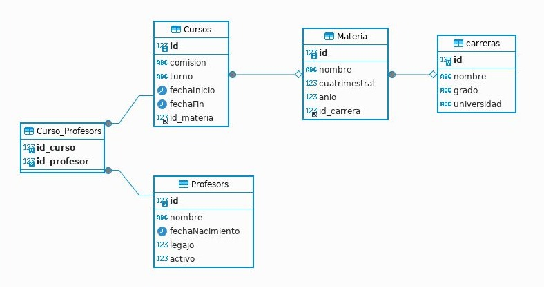

# Instrucciones para levantar y utilizar la api.

### CONFIGURACIONES INICIALES
Primero debemos tener el visual studio code abierto en la carpeta de la api.

Una vez hecho el paso anterior debemos correr el comando `npm i` para instalar las dependencias necesarias para el funcionamiento de la api.

La api está configurada para utilizar Sqlite por defecto, por lo tanto podemos utilizar el comando `npm run dev` para levantar la api y utilizar; o bien...

### Levantar imágenes en docker
Por otro lado si queremos utilizar otras bases de datos, dejamos configuradas dos *MySql* y *MariaDB*.
Para utilizar estos motores debemos levantar las imágenes de docker correspondientes.

Tenemos la opción de correr el comando ``docker-compose up`` para levantar ambas imágenes. 
O bien, ``docker-compose up node_db1`` para la imagen de MySql o ``docker-compose up node_db2`` para MariaDB si queremos levantar un sólo contenedor.

### Agregar otros motores de bases de datos
Podemos cambiar el archivo *docker-compose.yml*. Sólo debemos cambiar la *image* que utilizaremos y, si es necesario, configurar las variables de entorno.
No debería ser necesario si es similar a MySql y MariaDB. Al utulizar ``docker-compose up`` descargará la imagen, si no la tenemos, y levantará el container.

### Condifuración del motor de base de datos a utilizar
**IMPORTANTE:** Para setear el motor de base de datos a utilizar hay que cambiar el archivo **.env**. 
En dicho archivo debemos especificar el **dialect** que utilizaremos y en **port** debemos poner el correspondiente
La api está configurada para utilizar el ``port:3306`` para MySql y ``port:3307`` para MariaDB

Una vez levantados los containers correspondientes debemos abrir otra terminal para ejecutar ``npm run dev`` y la api estaría en funcionamiento.

### COMO UTILIZAR LA API
Para conectar a la base de datos podemos utilizar un cliente como DbEaver donde podremos acceder a la base de datos.
También podemos utilizar postman para utilizar los endpoints solicitados teniendo en cuenta que se levanta en local utilizaremos la ruta ``localhost:3000/``

##MODELO DER
